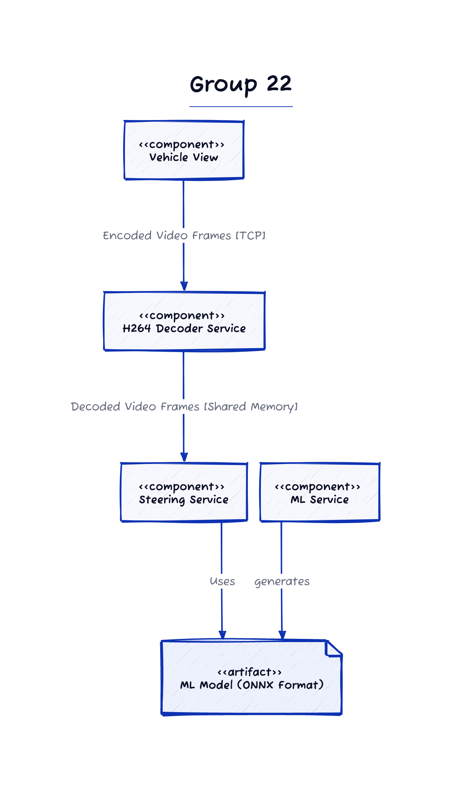

# 2024-group-22




## Requirements
- Docker
- docker compose (recommended for local development)


## How to check out the repository into a clean folder
1. Go to the location where you want to store this project

2. Copy to your terminal

```bash
git clone git@git.chalmers.se:courses/dit638/students/2024-group-22.git
```

3. Now a directory 2024-group-22 will be created in your current directory

4. Go to the project directory (cd 2024-group-22)
```bash
cd 2024-group-22
```

## Running as an examiner
If you're the examiner, you probably already have the vehicle_view and h264decoder running (otherwise you can refer to the next section and simply use docker compose).

Running it should work as you'd expect, meaning like documented in A13:

Running without UI: 
```bash
docker run --rm -ti --ipc=host -v /tmp:/tmp registry.git.chalmers.se/courses/dit638/students/2024-group-22:<tag> --cid=253 --name=img --width=640 --height=480
```

Running with UI:
```bash
docker run --rm -ti --ipc=host -e DISPLAY="$DISPLAY" -v /tmp:/tmp registry.git.chalmers.se/courses/dit638/students/2024-group-22:<tag> --cid=253 --name=img --width=640 --height=480 --verbose
```

Make sure to replace `<tag>` in the image URL and that your environment variable `$DISPLAY` is set.

Depending on your setup, you might also have to set `--net=host`

This should work for you, but some of our groups members had trouble running it like this, since the buildx build resulted in a different image then building it with "normal" docker with the `--platform` flag set to the desired architecture. In case this doesn't work for you (i.e. QT problems or the prediction is always the same), please refer to the next section using docker-compose.

## Running using docker compose

Training the ML model:

This step is optional, since the built model is commited into source control. So you can skip this step unless you've changed the ML code.
```bash
docker compose run --build train
```

This will save the generated ML model in ONNX format in `opencv-service/lib/models`.


1. Start the vehicle view and h264decoder microservices:
```bash
docker compose up vehicle-view h264decoder -d
```

2. Play some frames in the Web UI, so that there is data in the shared memory

3. Start the opencv-service:
```bash
docker compose run --build --rm opencv_service
```

Make sure that your `DISPLAY` environment variable is set and x11 forwarding is enabled.
For example, on MacOS using XQuartz, this might look something like this:
```bash
xhost + && DISPLAY=docker.for.mac.host.internal:0 docker compose run --build --rm opencv_service
```

Depending on your setup (if this doesn't work), you might have to set `network_mode: host` for the services in `docker-compose.yml`


## Commit messages style


All commit messages should start with a capital letter, use imperative voice and not use dots in the end of the sentence. The subject line should be concise and clear. If more complex things were changed, a commit body can be added, explaining why and how the change was made, but it is not mandatory for self-explanatory commits, such as e.g. fixing typos. All commit messages should link to the issue with # if there is an issue associated with it.


Example: `Create .gitignore #8`


## How to add new features
- The main branch should be protected - no commmits directly to main, only merges acceptable
- Remember to git pull before starting to work on a feature branch
- Every commit must be reviewed by another team member and only then merged. If merge conflicts appear, the person who commited the change fixes the merge conflicts locally and then commits again
- The branches will be created for different features
- An issue must be linked in the merge request. The merge request must follow the same naming convention as the subject line of the commit messages
- A merge requests must be peer reviewed and approved by another team member. If the team member finds any issued with the commited code, they should provide their feedback in the comments for the merge request, staying polite and constructive


## How to fix unexpected behaviour in existing features
- If a bug is discovered, a new issue with the label "bug" should be created
- If a bug is small, e.g. a typo that can be fixed by one person, one person can fix it
- If it is a big bug, we can have a discussion in a team on how to fix the problem and carefully review the code that caused the bug
